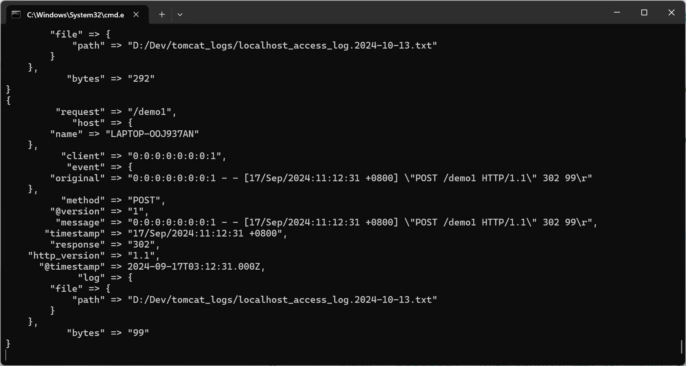
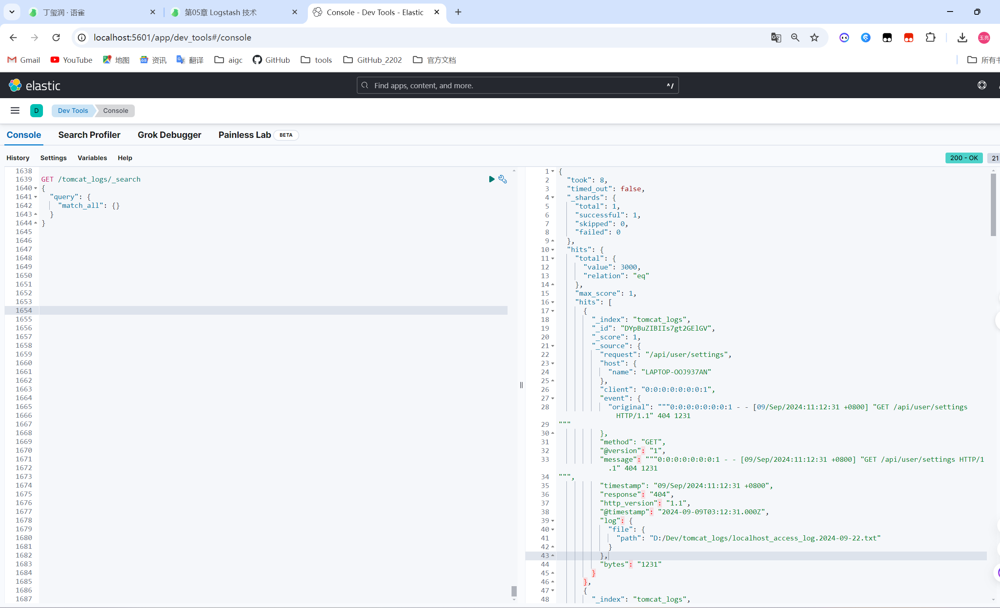
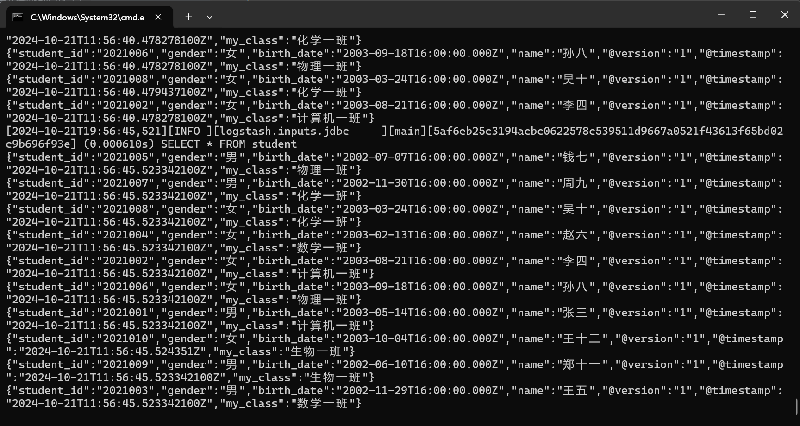
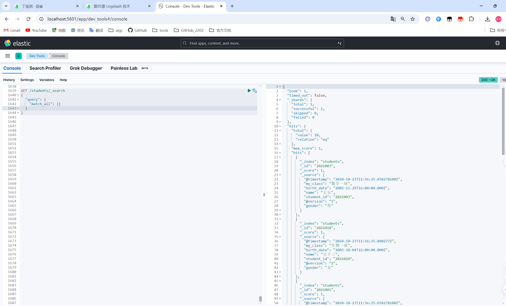
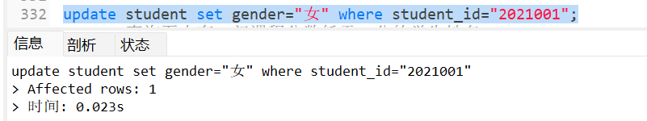
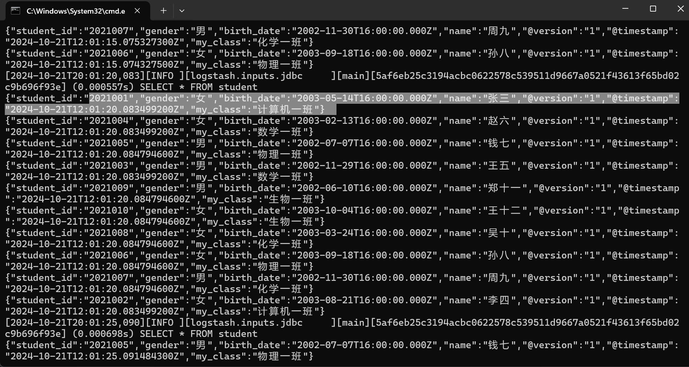
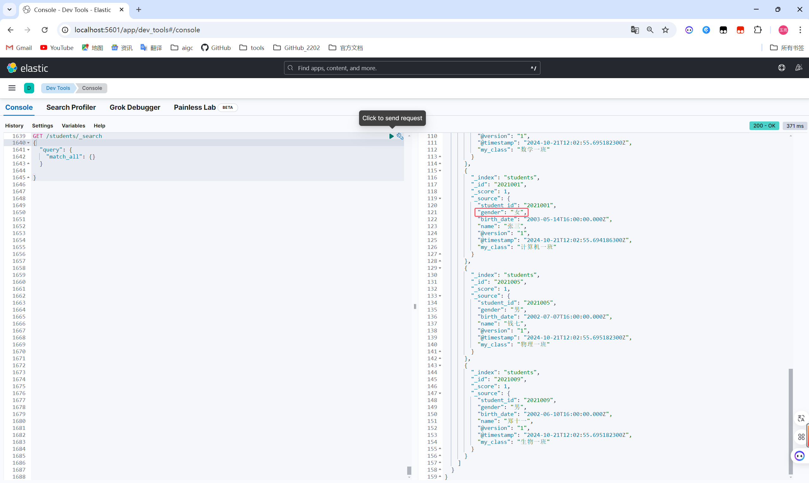

# 《实验四：Logstash操作》

> **学院：省级示范性软件学院**
>
> **课程：高级数据库技术与应用**
>
> **题目：《实验四：Logstash操作》**
>
> **姓名：唐玉亮**
>
> **学号：2100230021**
>
> **班级：软工2202**
>
> **日期：2024-10-21**
>
> **实验环境：Elasticsearch8.12.2、 Kibana8.12.2、Logstash8.12.2**

## 1. 实验目的

- 使用 Logstash数据收集与整合

- 使用 Logstash数据间转换

## 2. 实验内容

### 2.1 logstash安装及环境配置

#### 2.1.1 安装

- windows的logstash 8.12.2下载链接：https://artifacts.elastic.co/downloads/logstash/logstash-8.12.2-windows-x86_64.zip

#### 2.1.2 环境配置及启动

- 进入logstash安装目录下的config文件夹D:\Dev\logstash-8.12.2\config，创建logstash.conf配置文件，包含以下内容：

  ``` jsx
  input {
    file {
      path => "/var/log/messages"
      start_position => "beginning"
    }
  }
  
  filter {
    grok {
      match => { "message" => "%{COMBINEDAPACHELOG}" }
    }
  }
  
  output {
    elasticsearch {
      hosts => ["localhost:9200"]
    }
  }
  ```

  

- 进入 D:\Dev\logstash-8.12.2 执行下面运行 Logstash 的命令:

``` jsx
bin\logstash -f logstash.conf
```


### 2.2 tomcat日志处理

**数据来源：**本地的tomcat的logs中的日志

**要求：**

- 将tomcat的logs中的localhost_access_log访问日志导入到本地的elasticsearch中。
- 数据导入到一个名为tomcat_logs的索引。
- 在elasticsearch中做5个日志相关的分析，题目自拟。（提示：可以参考第04章聚合操作日志实战内容）

#### 2.2.1 编写配置文件

**注意：**在配置文件（如 Logstash 的配置文件）中，可以使用正斜杠（/）来表示路径。这是因为许多程序（包括 Java 和 Logstash）可以跨平台运行，它们通常支持使用正斜杠来避免转义问题。

- 进入logstash安装目录下的config文件夹D:\Dev\logstash-8.12.2\config，创建LogToES.conf配置文件，包含以下内容：

  ``` jsx
  input{
  	file{
  		path => "D:/Dev/tomcat_logs/*.txt" # 日志文件的路径
  		start_position => "beginning"
  		sincedb_path => "/dev/null" # 不记录读取位置，方便反复测试
  	}
  }
  
  filter {
    grok {
      match => { "message" => "%{IPV6:client} - - \[%{HTTPDATE:timestamp}\] \"%{WORD:method} %{URIPATH:request} HTTP/%{NUMBER:http_version}\" %{NUMBER:response} (?:%{NUMBER:bytes}|-)" }
    }
    date {
      match => [ "timestamp", "dd/MMM/yyyy:HH:mm:ss Z" ]
  	target => "@timestamp"
    }
  }
  
  output {
    elasticsearch {
      hosts => ["http://localhost:9200"] # Elasticsearch 地址
      index => "tomcat_logs" # 索引名称
    }
    stdout { codec => rubydebug }  # 输出到控制台，便于调试
  }
  ```

  

#### 2.2.2 运行命令

- 进入 D:\Dev\logstash-8.12.2 执行下面的命令：

  ```jsx
  bin\logstash.bat -f D:\Dev\logstash-8.12.2\config\LogToES.conf
  ```

- 成功运行：

  

#### 2.2.3 验证：在elasticsearch中查询tomcat_logs索引

- 在kibana中查询：

  ```json
  GET /tomcat_logs/_search
  {
    "query": {
      "match_all": {}
    }
  }
  ```

- 成功运行：

  

#### 2.2.4 日志相关的分析查询

1. 总体请求统计：查询总请求数和前3个最常见的状态码

   - 代码：

   ``` json
   GET /tomcat_logs/_search
   {
     "size": 0,
     "aggs": {
       "total_requests": {
         "value_count": {
           "field": "request.keyword"
         }
       },
       "top_status_codes": {
         "terms": {
           "field": "response.keyword",
           "size": 3
         }
       }
     }
   }
   ```

   - 结果：

   ```json
   {
     "took": 1,
     "timed_out": false,
     "_shards": {
       "total": 1,
       "successful": 1,
       "skipped": 0,
       "failed": 0
     },
     "hits": {
       "total": {
         "value": 3000,
         "relation": "eq"
       },
       "max_score": null,
       "hits": []
     },
     "aggregations": {
       "top_status_codes": {
         "doc_count_error_upper_bound": 0,
         "sum_other_doc_count": 732,
         "buckets": [
           {
             "key": "500",
             "doc_count": 781
           },
           {
             "key": "200",
             "doc_count": 749
           },
           {
             "key": "404",
             "doc_count": 738
           }
         ]
       },
       "total_requests": {
         "value": 3000
       }
     }
   }
   ```

   

2. 每小时请求量分析

   - 代码：

   ```json
   GET /tomcat_logs/_search
   {
     "size": 0,
     "aggs": {
       "requests_per_hour": {
         "date_histogram": {
           "field": "@timestamp",
           "calendar_interval": "hour"
         },
         "aggs": {
           "request_count": {
             "value_count": {
               "field": "request"  // 假设这里是请求字段
             }
           },
           "filtered_requests": {
             "bucket_selector": {
               "buckets_path": {
                 "requestCount": "request_count"
               },
               "script": "params.requestCount > 0"
             }
           }
         }
       }
     }
   }
   
   ```

   - 结果：

   ```json
   {
     "took": 9,
     "timed_out": false,
     "_shards": {
       "total": 1,
       "successful": 1,
       "skipped": 0,
       "failed": 0
     },
     "hits": {
       "total": {
         "value": 3000,
         "relation": "eq"
       },
       "max_score": null,
       "hits": []
     },
     "aggregations": {
       "requests_per_hour": {
         "buckets": [
           {
             "key_as_string": "2024-08-24T03:00:00.000Z",
             "key": 1724468400000,
             "doc_count": 3,
             "request_count": {
               "value": 3
             }
           },
           {
             "key_as_string": "2024-08-25T03:00:00.000Z",
             "key": 1724554800000,
             "doc_count": 11,
             "request_count": {
               "value": 11
             }
           },
           {
             "key_as_string": "2024-08-26T03:00:00.000Z",
             "key": 1724641200000,
             "doc_count": 10,
             "request_count": {
               "value": 10
             }
           },
           {
             "key_as_string": "2024-08-27T03:00:00.000Z",
             "key": 1724727600000,
             "doc_count": 11,
             "request_count": {
               "value": 11
             }
           },
           {
             "key_as_string": "2024-08-28T03:00:00.000Z",
             "key": 1724814000000,
             "doc_count": 18,
             "request_count": {
               "value": 18
             }
           },
           {
             "key_as_string": "2024-08-29T03:00:00.000Z",
             "key": 1724900400000,
             "doc_count": 16,
             "request_count": {
               "value": 16
             }
           },
           {
             "key_as_string": "2024-08-30T03:00:00.000Z",
             "key": 1724986800000,
             "doc_count": 27,
             "request_count": {
               "value": 27
             }
           },
           {
             "key_as_string": "2024-08-31T03:00:00.000Z",
             "key": 1725073200000,
             "doc_count": 30,
             "request_count": {
               "value": 30
             }
           },
           {
             "key_as_string": "2024-09-01T03:00:00.000Z",
             "key": 1725159600000,
             "doc_count": 27,
             "request_count": {
               "value": 27
             }
           },
           {
             "key_as_string": "2024-09-02T03:00:00.000Z",
             "key": 1725246000000,
             "doc_count": 42,
             "request_count": {
               "value": 42
             }
           },
           {
             "key_as_string": "2024-09-03T03:00:00.000Z",
             "key": 1725332400000,
             "doc_count": 41,
             "request_count": {
               "value": 41
             }
           },
           {
             "key_as_string": "2024-09-04T03:00:00.000Z",
             "key": 1725418800000,
             "doc_count": 51,
             "request_count": {
               "value": 51
             }
           },
           {
             "key_as_string": "2024-09-05T03:00:00.000Z",
             "key": 1725505200000,
             "doc_count": 54,
             "request_count": {
               "value": 54
             }
           },
           {
             "key_as_string": "2024-09-06T03:00:00.000Z",
             "key": 1725591600000,
             "doc_count": 49,
             "request_count": {
               "value": 49
             }
           },
           {
             "key_as_string": "2024-09-07T03:00:00.000Z",
             "key": 1725678000000,
             "doc_count": 43,
             "request_count": {
               "value": 43
             }
           },
           {
             "key_as_string": "2024-09-08T03:00:00.000Z",
             "key": 1725764400000,
             "doc_count": 54,
             "request_count": {
               "value": 54
             }
           },
           {
             "key_as_string": "2024-09-09T03:00:00.000Z",
             "key": 1725850800000,
             "doc_count": 44,
             "request_count": {
               "value": 44
             }
           },
           {
             "key_as_string": "2024-09-10T03:00:00.000Z",
             "key": 1725937200000,
             "doc_count": 64,
             "request_count": {
               "value": 64
             }
           },
           {
             "key_as_string": "2024-09-11T03:00:00.000Z",
             "key": 1726023600000,
             "doc_count": 61,
             "request_count": {
               "value": 61
             }
           },
           {
             "key_as_string": "2024-09-12T03:00:00.000Z",
             "key": 1726110000000,
             "doc_count": 76,
             "request_count": {
               "value": 76
             }
           },
           {
             "key_as_string": "2024-09-13T03:00:00.000Z",
             "key": 1726196400000,
             "doc_count": 78,
             "request_count": {
               "value": 78
             }
           },
           {
             "key_as_string": "2024-09-14T03:00:00.000Z",
             "key": 1726282800000,
             "doc_count": 68,
             "request_count": {
               "value": 68
             }
           },
           {
             "key_as_string": "2024-09-15T03:00:00.000Z",
             "key": 1726369200000,
             "doc_count": 64,
             "request_count": {
               "value": 64
             }
           },
           {
             "key_as_string": "2024-09-16T03:00:00.000Z",
             "key": 1726455600000,
             "doc_count": 83,
             "request_count": {
               "value": 83
             }
           },
           {
             "key_as_string": "2024-09-17T03:00:00.000Z",
             "key": 1726542000000,
             "doc_count": 94,
             "request_count": {
               "value": 94
             }
           },
           {
             "key_as_string": "2024-09-18T03:00:00.000Z",
             "key": 1726628400000,
             "doc_count": 83,
             "request_count": {
               "value": 83
             }
           },
           {
             "key_as_string": "2024-09-19T03:00:00.000Z",
             "key": 1726714800000,
             "doc_count": 95,
             "request_count": {
               "value": 95
             }
           },
           {
             "key_as_string": "2024-09-20T03:00:00.000Z",
             "key": 1726801200000,
             "doc_count": 102,
             "request_count": {
               "value": 102
             }
           },
           {
             "key_as_string": "2024-09-21T03:00:00.000Z",
             "key": 1726887600000,
             "doc_count": 76,
             "request_count": {
               "value": 76
             }
           },
           {
             "key_as_string": "2024-09-22T03:00:00.000Z",
             "key": 1726974000000,
             "doc_count": 83,
             "request_count": {
               "value": 83
             }
           },
           {
             "key_as_string": "2024-09-23T03:00:00.000Z",
             "key": 1727060400000,
             "doc_count": 85,
             "request_count": {
               "value": 85
             }
           },
           {
             "key_as_string": "2024-09-24T03:00:00.000Z",
             "key": 1727146800000,
             "doc_count": 90,
             "request_count": {
               "value": 90
             }
           },
           {
             "key_as_string": "2024-09-25T03:00:00.000Z",
             "key": 1727233200000,
             "doc_count": 84,
             "request_count": {
               "value": 84
             }
           },
           {
             "key_as_string": "2024-09-26T03:00:00.000Z",
             "key": 1727319600000,
             "doc_count": 101,
             "request_count": {
               "value": 101
             }
           },
           {
             "key_as_string": "2024-09-27T03:00:00.000Z",
             "key": 1727406000000,
             "doc_count": 99,
             "request_count": {
               "value": 99
             }
           },
           {
             "key_as_string": "2024-09-28T03:00:00.000Z",
             "key": 1727492400000,
             "doc_count": 76,
             "request_count": {
               "value": 76
             }
           },
           {
             "key_as_string": "2024-09-29T03:00:00.000Z",
             "key": 1727578800000,
             "doc_count": 89,
             "request_count": {
               "value": 89
             }
           },
           {
             "key_as_string": "2024-09-30T03:00:00.000Z",
             "key": 1727665200000,
             "doc_count": 67,
             "request_count": {
               "value": 67
             }
           },
           {
             "key_as_string": "2024-10-01T03:00:00.000Z",
             "key": 1727751600000,
             "doc_count": 71,
             "request_count": {
               "value": 71
             }
           },
           {
             "key_as_string": "2024-10-02T03:00:00.000Z",
             "key": 1727838000000,
             "doc_count": 67,
             "request_count": {
               "value": 67
             }
           },
           {
             "key_as_string": "2024-10-03T03:00:00.000Z",
             "key": 1727924400000,
             "doc_count": 64,
             "request_count": {
               "value": 64
             }
           },
           {
             "key_as_string": "2024-10-04T03:00:00.000Z",
             "key": 1728010800000,
             "doc_count": 58,
             "request_count": {
               "value": 58
             }
           },
           {
             "key_as_string": "2024-10-05T03:00:00.000Z",
             "key": 1728097200000,
             "doc_count": 57,
             "request_count": {
               "value": 57
             }
           },
           {
             "key_as_string": "2024-10-06T03:00:00.000Z",
             "key": 1728183600000,
             "doc_count": 59,
             "request_count": {
               "value": 59
             }
           },
           {
             "key_as_string": "2024-10-07T03:00:00.000Z",
             "key": 1728270000000,
             "doc_count": 46,
             "request_count": {
               "value": 46
             }
           },
           {
             "key_as_string": "2024-10-08T03:00:00.000Z",
             "key": 1728356400000,
             "doc_count": 46,
             "request_count": {
               "value": 46
             }
           },
           {
             "key_as_string": "2024-10-09T03:00:00.000Z",
             "key": 1728442800000,
             "doc_count": 41,
             "request_count": {
               "value": 41
             }
           },
           {
             "key_as_string": "2024-10-10T03:00:00.000Z",
             "key": 1728529200000,
             "doc_count": 22,
             "request_count": {
               "value": 22
             }
           },
           {
             "key_as_string": "2024-10-11T03:00:00.000Z",
             "key": 1728615600000,
             "doc_count": 39,
             "request_count": {
               "value": 39
             }
           },
           {
             "key_as_string": "2024-10-12T03:00:00.000Z",
             "key": 1728702000000,
             "doc_count": 34,
             "request_count": {
               "value": 34
             }
           },
           {
             "key_as_string": "2024-10-13T03:00:00.000Z",
             "key": 1728788400000,
             "doc_count": 22,
             "request_count": {
               "value": 22
             }
           },
           {
             "key_as_string": "2024-10-14T03:00:00.000Z",
             "key": 1728874800000,
             "doc_count": 26,
             "request_count": {
               "value": 26
             }
           },
           {
             "key_as_string": "2024-10-15T03:00:00.000Z",
             "key": 1728961200000,
             "doc_count": 24,
             "request_count": {
               "value": 24
             }
           },
           {
             "key_as_string": "2024-10-16T03:00:00.000Z",
             "key": 1729047600000,
             "doc_count": 23,
             "request_count": {
               "value": 23
             }
           },
           {
             "key_as_string": "2024-10-17T03:00:00.000Z",
             "key": 1729134000000,
             "doc_count": 18,
             "request_count": {
               "value": 18
             }
           },
           {
             "key_as_string": "2024-10-18T03:00:00.000Z",
             "key": 1729220400000,
             "doc_count": 12,
             "request_count": {
               "value": 12
             }
           },
           {
             "key_as_string": "2024-10-19T03:00:00.000Z",
             "key": 1729306800000,
             "doc_count": 11,
             "request_count": {
               "value": 11
             }
           },
           {
             "key_as_string": "2024-10-20T03:00:00.000Z",
             "key": 1729393200000,
             "doc_count": 7,
             "request_count": {
               "value": 7
             }
           },
           {
             "key_as_string": "2024-10-21T03:00:00.000Z",
             "key": 1729479600000,
             "doc_count": 4,
             "request_count": {
               "value": 4
             }
           }
         ]
       }
     }
   }
   ```

   

3. 错误状态码分析

   - 代码：

   ```json
   GET /tomcat_logs/_search
   {
     "size": 0,
     "query": {
       "range": {
         "response": {
           "gte": 400
         }
       }
     }, 
     "aggs": {
       "error_codes": {
         "terms": {
           "field": "response.keyword",
           "size": 10
         }
       }
     }
   }
   
   ```

   - 结果：

   ```json
   {
     "took": 3,
     "timed_out": false,
     "_shards": {
       "total": 1,
       "successful": 1,
       "skipped": 0,
       "failed": 0
     },
     "hits": {
       "total": {
         "value": 1519,
         "relation": "eq"
       },
       "max_score": null,
       "hits": []
     },
     "aggregations": {
       "error_codes": {
         "doc_count_error_upper_bound": 0,
         "sum_other_doc_count": 0,
         "buckets": [
           {
             "key": "500",
             "doc_count": 781
           },
           {
             "key": "404",
             "doc_count": 738
           }
         ]
       }
     }
   }
   ```

   

4. 最常见请求路径分析

   - 代码：

   ```json
   GET /tomcat_logs/_search
   {
     "size": 0,
     "aggs": {
       "top_requests": {
         "terms": {
           "field": "request.keyword",
           "size": 10
         }
       }
     }
   }
   ```

   - 结果

   ```json
   {
     "took": 0,
     "timed_out": false,
     "_shards": {
       "total": 1,
       "successful": 1,
       "skipped": 0,
       "failed": 0
     },
     "hits": {
       "total": {
         "value": 3000,
         "relation": "eq"
       },
       "max_score": null,
       "hits": []
     },
     "aggregations": {
       "top_requests": {
         "doc_count_error_upper_bound": 0,
         "sum_other_doc_count": 1664,
         "buckets": [
           {
             "key": "/demo1/",
             "doc_count": 153
           },
           {
             "key": "/examples/jsp/images/execute.gif",
             "doc_count": 141
           },
           {
             "key": "/static/js/app.js",
             "doc_count": 139
           },
           {
             "key": "/about",
             "doc_count": 137
           },
           {
             "key": "/static/css/style.css",
             "doc_count": 134
           },
           {
             "key": "/demo/",
             "doc_count": 133
           },
           {
             "key": "/blog/post/2",
             "doc_count": 127
           },
           {
             "key": "/demo/hello",
             "doc_count": 127
           },
           {
             "key": "/examples/jsp/images/return.gif",
             "doc_count": 124
           },
           {
             "key": "/blog/post/3",
             "doc_count": 121
           }
         ]
       }
     }
   }
   ```

   

5. 客户端请求分布分析

   - 代码：

   ```json
   GET /tomcat_logs/_search
   {
     "size": 0,
     "aggs": {
       "client_requests": {
         "terms": {
           "field": "client.keyword",
           "size": 10
         }
       }
     }
   }
   ```

   - 结果：

   ```json
   {
     "took": 8,
     "timed_out": false,
     "_shards": {
       "total": 1,
       "successful": 1,
       "skipped": 0,
       "failed": 0
     },
     "hits": {
       "total": {
         "value": 3000,
         "relation": "eq"
       },
       "max_score": null,
       "hits": []
     },
     "aggregations": {
       "client_requests": {
         "doc_count_error_upper_bound": 0,
         "sum_other_doc_count": 0,
         "buckets": [
           {
             "key": "0:0:0:0:0:0:0:1",
             "doc_count": 3000
           }
         ]
       }
     }
   }
   ```

   

### 2.3 数据转换和传输

**要求：**

- 将本地的mysql数据库中的一张表导入到本地的elasticsearch中。

- 数据库表更新后，数据能够自动同步到elasticsearch中。

#### 2.3.1 编写配置文件

**注意：**在配置文件（如 Logstash 的配置文件）中，可以使用正斜杠（/）来表示路径。这是因为许多程序（包括 Java 和 Logstash）可以跨平台运行，它们通常支持使用正斜杠来避免转义问题。

- 进入logstash安装目录下的config文件夹D:\Dev\logstash-8.12.2\config，创建MysqlToES.conf配置文件，包含以下内容：

``` jsx
input {
  jdbc {
    jdbc_driver_library => "D:/Dev/logstash-8.12.2/jar/mysql-connector-j-9.1.0.jar"
    jdbc_driver_class => "com.mysql.cj.jdbc.Driver"
    jdbc_connection_string => "jdbc:mysql://127.0.0.1:3306/students_management"
    jdbc_user => "root"
    jdbc_password => "123456"
    statement => "SELECT * FROM student"
    schedule => "*/5 * * * * *" 
  }
}

output {
  elasticsearch {
    hosts => ["http://localhost:9200"]
    index => "students"
    document_id => "%{student_id}" 
  }
  stdout { codec => json_lines }
}
```

#### 2.3.2 运行命令

- 进入 D:\Dev\logstash-8.12.2 执行下面的命令：

  ``` jsx
  bin\logstash.bat -f D:\Dev\logstash-8.12.2\config\MysqlToES.conf
  ```

- 成功运行：

  

#### 2.3.3 验证：在elasticsearch中查询students索引

- 在kibana中查询：

  ``` json
  GET /students/_search
  {
    "query": {
      "match_all": {}
    }
  }
  ```




#### 2.3.4 验证数据同步问题

- 更新student表中的数据：



- 更新数据库student表后，可以看到更新的数据能够自动同步到elasticsearch中：






## 3. 问题及解决办法