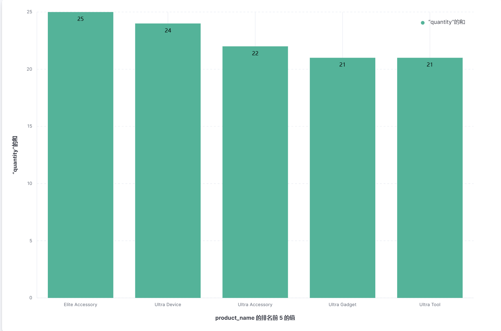
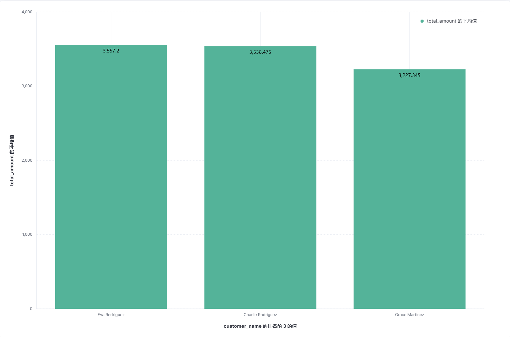

# 《实验五：Kibana操作》

> **学院：省级示范性软件学院**
>
> **课程：高级数据库技术与应用**
>
> **题目：《实验五：Kibana操作》**
>
> **姓名：唐玉亮**
>
> **学号：2100230021**
>
> **班级：软工2202**
>
> **日期：2024-11-04**
>
> **实验环境：Elasticsearch8.12.2、 Kibana8.12.2、Logstash8.12.2**

## 1. 实验目的

- 使用Kibana进行制作仪表盘

## 2. 实验要求

- 1. 使用Kibana完成[实验三 聚合操作](https://www.yuque.com/u369937/wskurb/nizzczly3ahu08t9)的 10道题

- 2. 制作仪表盘

## 3. 实验内容

### 3.1 配置Kibana

在使用 Kibana 之前，需要确保 Elasticsearch 已经安装并运行。Kibana 需要连接到一个正在运行的 Elasticsearch 实例。可以通过修改 Kibana 的配置文件 kibana.yml 来指定 Elasticsearch 的地址：

- 进入kibana目录下并按cmd，输入以下命令生成key：

``` 
bin\kibana-encryption-keys.bat generate
```

- 将生成的key添加到kibana.yml文件里：

``` yml
i18n.locale: "zh-CN"
elasticsearch.hosts: ["http://localhost:9200"]
xpack.encryptedSavedObjects.encryptionKey: 93afe88b7ea1e0014b1499530a7a9103
xpack.reporting.encryptionKey: eff06a6e0db99b7fa5567a79fe776bee
xpack.security.encryptionKey: f0e8568bfaeb9aef848774a7f69d007f
```


### 3.2 使用Kibana完成[实验三 聚合操作](https://www.yuque.com/u369937/wskurb/nizzczly3ahu08t9)的 10道题

#### 3.2.1 统计每个产品类别的总销售额。

- 选择垂直堆积条形图，以product_category为水平轴，以total_amount求和为垂直轴

  

#### 3.2.2 计算每个城市的平均订单金额。

- 选择垂直堆积条形图，以product_city为水平轴，以total_amount的平均值为垂直轴


#### 3.2.3 找出销量最高的前5个产品。

- 选择垂直条形图，以product_name为水平轴，以quantity求和为垂直轴

  

#### 3.2.4 计算男性和女性客户的平均年龄。

- 选择圆圈图，切片依据为customer_gender,指标为customer_age的平均值

  

#### 3.2.5 统计每种支付方式的使用次数和总金额。

- 选择payment_method为水平轴，total_amount求和为垂直轴作条形图，并添加一个折线图层，以payment_method为水平轴，以quantity求和为垂直右轴的折线图：


#### 3.2.6 计算每月的总销售额。

- 选择以order_date（最小时间间隔为1月，取消绑定到全局时间选取器）为水平轴，以total_amount的和为垂直轴作水平条形图：


#### 3.2.7 找出平均订单金额最高的前3个客户。

- 选择以customer_name（数值目为3）为水平轴，以total_amount平均值为垂直轴作垂直条形图：



#### 3.2.8 计算每个年龄段（18-30，31-50，51+）的客户数量。

- 选择以customer_age（并添加三个范围）为水平轴，以customer_id的唯一计数为垂直轴作垂直条形图：


#### 3.2.9 计算每个产品类别的平均单价。

- 选择以product_category（前10）为水平轴，以price的平均值为垂直轴作垂直条形图：


#### 3.2.10 找出订单数量最多的前5个城市。

- 选择以customer_city(前5)为水平轴，以order_id的唯一计数为垂直轴作垂直条形图：


### 3.3 制作仪表盘


## 4. 遇到的问题及解决方案